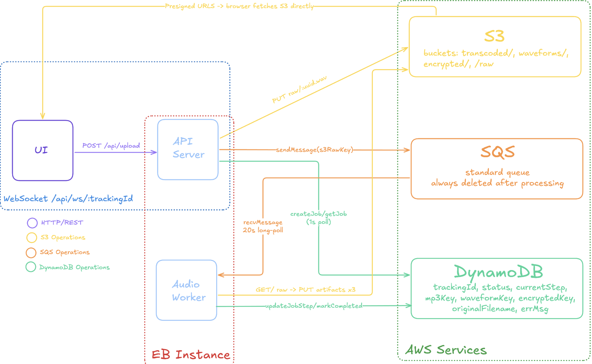

# CloudStem — CS310 Final Project

A cloud-native audio processing pipeline built for producers and DJs. Drop a raw `.wav` stem and CloudStem transcodes it for web streaming, generates a visual waveform, and encrypts the original for secure long-term storage, all on AWS.

---

## Tech Stack

| Layer           | Technology                           |
| --------------- | ------------------------------------ |
| Frontend        | Next.js 16, React 19, Tailwind CSS 4 |
| Backend API     | Node.js, Express 5, TypeScript       |
| Message Queue   | Amazon SQS                           |
| Object Storage  | Amazon S3                            |
| Database        | Amazon DynamoDB                      |
| Compute         | Amazon EC2 (Ubuntu/Amazon Linux)     |
| Process Manager | pm2                                  |

---

## Architecture



### S3 Key Prefixes

| Prefix        | Content                                           |
| ------------- | ------------------------------------------------- |
| `raw/`        | Original WAV (temporary, uploaded on ingest)      |
| `transcoded/` | MP3 at 320 kbps                                   |
| `waveforms/`  | JSON array of 300 amplitude points                |
| `encrypted/`  | AES-256-CBC encrypted original WAV (IV prepended) |

---

## Three Non-Trivial Operations

### 1. Audio Transcoding (`audioProcessor.ts`)

Uses **FFmpeg** via `fluent-ffmpeg` to convert the uploaded `.wav` to a web-compatible `.mp3` at 320 kbps (`libmp3lame` codec). The transcoded file is streamed directly to S3 for playback via presigned URL.

### 2. Algorithmic Waveform Generation (`audioProcessor.ts`)

FFmpeg decodes the audio to raw 16-bit PCM mono at 22 050 Hz. The PCM buffer is chunked into 300 equal blocks; the peak amplitude in each block is sampled and normalised to the `[0, 1]` range. The result is a compact 300-point JSON array rendered in the browser as an interactive canvas waveform with a seekable playhead.

### 3. File Encryption (`audioProcessor.ts`)

The original master file is encrypted with **AES-256-CBC** using Node's built-in `crypto` module. A random 16-byte IV is generated per file and prepended to the ciphertext before S3 upload. Users can decrypt the file entirely in-browser using the Web Crypto API with the shared hex key — no server round-trip required for decryption.

---

## Local Development Setup

### Prerequisites

- Node.js 22+
- `ffmpeg` installed on your machine (`brew install ffmpeg` on macOS)
- AWS credentials with access to S3, SQS, and DynamoDB

### 1. Clone and install

```bash
git clone <repo-url>
cd final-project

# backend
cd backend
npm install
cp .env.example .env   # fill in your AWS credentials

# frontend
cd ../frontend
npm install
cp .env.example .env
```

### 2. Start backend API server

```bash
cd backend
npm run dev          # express on http://localhost:8000
```

### 3. Start the audio worker (separate terminal)

```bash
cd backend
npm run worker       # SQS long-poll worker
```

### 4. Start frontend

```bash
cd frontend
npm run dev          # Next.js on http://localhost:3000
```

### 5. Run integration tests

```bash
cd backend
npm test             # vitest — tests S3, DynamoDB, SQS connectivity
```

---

## EC2 Deployment

### 1. Launch an EC2 instance

- AMI: Amazon Linux 2023 or Ubuntu 22.04 LTS
- Instance type: `t3.medium` or larger (FFmpeg is CPU-intensive)
- Security group: allow inbound TCP on ports **22** (SSH), **8000** (API), **3000** (frontend)
- Attach an IAM role with policies: `AmazonS3FullAccess`, `AmazonSQSFullAccess`, `AmazonDynamoDBFullAccess` (scope down for production)

### 2. Bootstrap the instance

```bash
# SSH into the instance
ssh -i your-key.pem ec2-user@<public-ip>

# download and run the setup script
curl -O https://raw.githubusercontent.com/<org>/cs310-final-project/main/scripts/ec2-setup.sh
sudo bash ec2-setup.sh
```

The script installs Node.js 22, ffmpeg, git, and pm2, then clones the repo and installs dependencies.

### 3. Configure environment variables

```bash
cd /opt/cloudstem/backend
sudo cp .env.example .env
sudo nano .env          # fill in AWS credentials and resource names

cd /opt/cloudstem/frontend
sudo cp .env.example .env
sudo nano .env          # set NEXT_PUBLIC_API_URL=http://<ec2-public-ip>:8000
```

### 4. Start with pm2

```bash
cd /opt/cloudstem
pm2 start ecosystem.config.cjs
pm2 save
pm2 startup            # follow the printed command to enable auto-restart on reboot
```

### 5. Verify

```bash
pm2 list               # all three processes should be "online"
curl http://localhost:8000/health   # -> {"message":"working!"}
```

---

## AWS Resources

| Service  | Resource Name            | Purpose                                                         |
| -------- | ------------------------ | --------------------------------------------------------------- |
| S3       | `cloud-stem-audio-files` | Stores raw, transcoded, waveform, and encrypted files           |
| SQS      | `audio-processing-queue` | Decouples upload from processing                                |
| DynamoDB | `AudioProcessingJobs`    | Tracks job status and S3 keys per upload                        |
| EC2      | —                        | Runs the Express API server, audio worker, and Next.js frontend |

---

## Project Structure

```
final-project/
├── backend/
│   ├── server.ts                  # express + WebSocket server
│   ├── src/
│   │   ├── config/aws.ts          # AWS SDK client factory
│   │   ├── controllers/
│   │   │   ├── uploadController.ts
│   │   │   └── statusController.ts
│   │   ├── routes/apiRoutes.ts
│   │   ├── services/
│   │   │   ├── s3Service.ts
│   │   │   ├── sqsService.ts
│   │   │   ├── dynamoService.ts
│   │   │   └── audioProcessor.ts  # SQS worker (transcode/waveform/encrypt)
│   │   ├── tests/
│   │   └── util/
│   ├── .env.example
│   └── package.json
├── frontend/
│   ├── src/
│   │   ├── app/
│   │   └── components/
│   │       ├── CloudStemApp.tsx   # app state machine
│   │       ├── UploadZone.tsx     # drag-and-drop upload
│   │       ├── ProcessingStatus.tsx  # WebSocket status display
│   │       └── AudioPlayer.tsx    # canvas waveform + frequency visualizer
│   ├── .env.example
│   └── package.json
├── scripts/
│   └── ec2-setup.sh               # EC2 bootstrap
├── ecosystem.config.cjs           # pm2 process config
├── .gitignore
└── README.md
```
